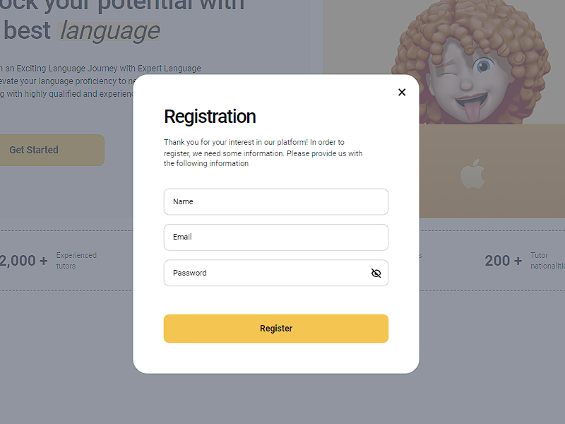
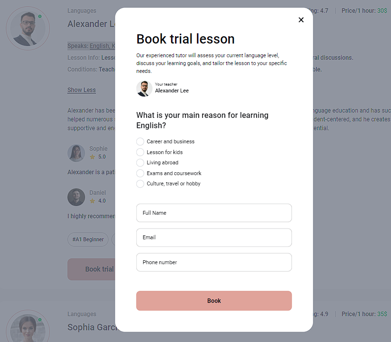
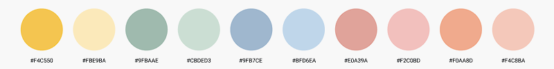

**Read in another language: [Ukrainian](README.ua.md).**

# Web application "LearnLingo"

An app for a company that provides online language lessons.

## Table of contents

- [Project overview](#project-overview)
- [Technologies used](#technologies-used)
- [Installation](#instalattion)
- [Configuration](#configuration)
- [Server Commands](#server-commands)

## Project Overview

- User authorization that provides access to a private environment.
  
- Home page with description of benefits and link to the 'Teachers' page.
- Page, 'Teachers' with a list of all available teachers.
- Filtering teachers by language, level and price,
  
- Private 'Favorites' page for teachers selected by the user.
  
- Teacher's card with description and reviews.
  
- Trial lesson order form for users.(in the teacher's card, details)
  
- Automatic change of the color theme of the site once every 2 minutes (optional).
  

## Technologies Used

Frameworks and Libraries

- React: The main framework for building user interfaces.
- Redux: State management for the application.
- React Router Dom: Routing within the application.
- Firebase: Backend for authentication and data storage.

Styling

- Tailwind CSS: Utility-first CSS framework for styling components.
- Modern Normalize and Normalize.css: CSS reset to unify styles across different browsers.

Forms and Validation

- React Hook Form: Form management and state handling.
- Yup: Schema validation for forms.
- @hookform/resolvers: Integration of Yup with React Hook Form.
- State Management and Persistence
- @reduxjs/toolkit: A set of tools for convenient Redux usage.
- redux-persist: Persisting Redux state in local storage.

Utility Libraries

- React Select: Components for creating dropdown lists.
- React Toastify: Notifications and toasts.
- React Spinners: Spinners and loading indicators.

Build and Development Tools

- Vite: Fast build and development tool.
- Vite Plugin React SWC: Plugin for integrating React with Vite.
- Vite Plugin SVGR: Plugin for working with SVG as React components.

Linting and Formatting

- ESLint: Code linting.
- Prettier: Code formatting.
- @typescript-eslint: Integration of TypeScript with ESLint.
- Husky and Lint-staged: Automation of linting and formatting tasks on commits.

Typing

- TypeScript: Strong typing for JavaScript.
- @types/react and @types/react-dom: Types for React and React DOM.

## Installation

1. Clone this repository to your local computer.
2. Open the terminal and navigate to the root folder of the project.
3. Run the command `npm install` to install project dependencies.

## Configuration

1. Create a .env file in the project's root folder, based on the .env.example file.
2. Specify the necessary environment variables in this file.

## Server Commands

**npm:**

- `npm run build` — Start the server in production mode.
- `npm run dev` — Start the server in development mode.
- `npm run lint` — Run code linting using eslint. Perform this before each PR and fix all linting errors.
