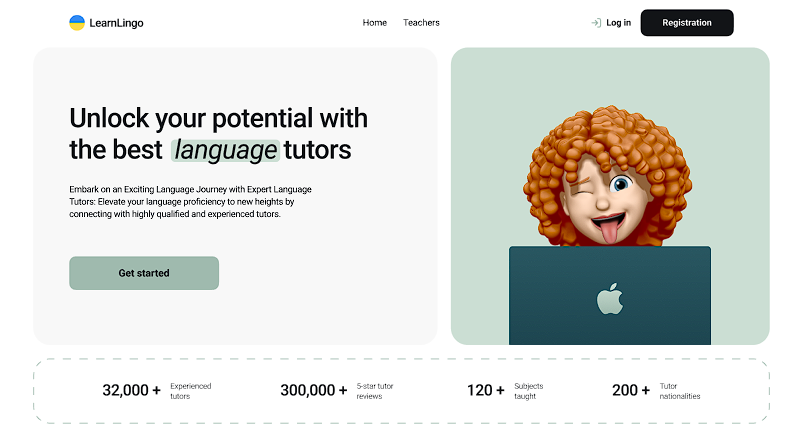
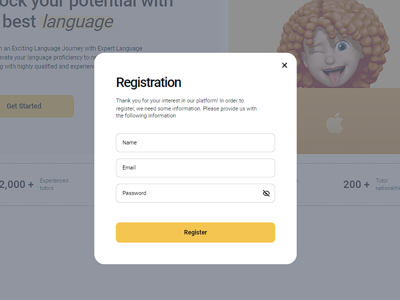
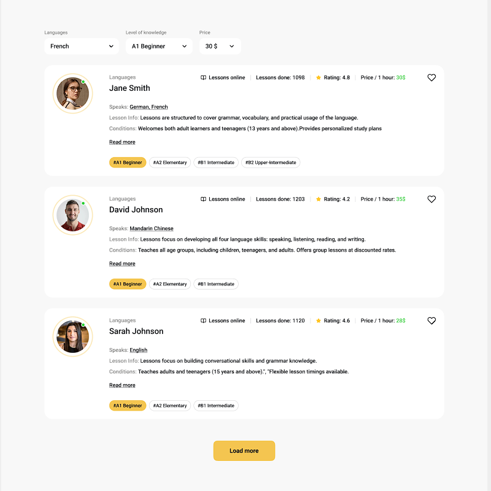
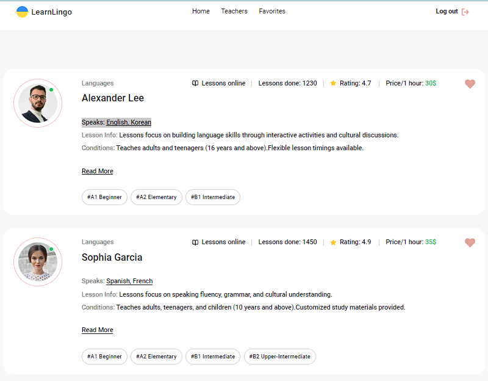
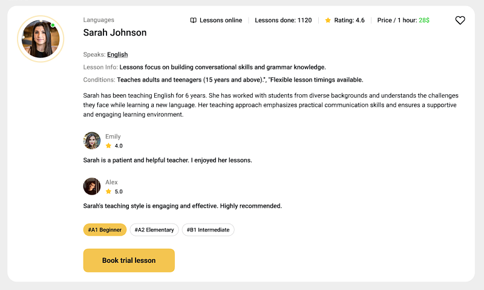
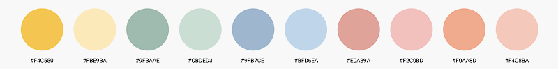

**Читати іншою мовою: [Англійська](README.md).**

# Веб застосунок "LearnLingo"

Застосунок для компанії, яка надає онлайн-уроки з вивчення мов.

## Зміст

- [Огляд проекту](#огляд-проекту)
- [Використані технології](#використані-технології)
- [Інсталяція](#інсталяція)
- [Конфігурація](#конфігурація)
- [Команди сервера](#команди-сервера)

## Огляд проекту

- Авторізація користувачів яка надае доступ до приватного середовища.
  
- Домашня сторінка 'Home' з описом переваг і посиланням на сторінку 'Teachers'.
- Сторінка, 'Teachers' зі списком всіх доступних вчителів.
- Фільтрацією викладачів за мовою, рівнем і ціною,
  
- Приватна сторінка 'Favorites' для обраних викладачів користувачем.
  
- Картка вчителя з детальним описом та відгуками.
  
- Форма заказу пробного уроку для користувачів (в карточке учителя , подробно)
  
- Автозміна колірної теми сайту раз на 2хв (опціонально).
  

## Використані технології

Фреймворки та бібліотеки

- React: Основний фреймворк для створення користувацьких інтерфейсів.
- Redux: Управління станом застосунку.
- React Router Dom: Маршрутизація всередині застосунку.
- Firebase: Бекенд для автентифікації та зберігання даних.

Стилізація

- Tailwind CSS: Утилітарний CSS-фреймворк для стилізації компонентів.
- Modern Normalize і Normalize.css: Скидання стилів для уніфікації відображення у різних браузерах.

Форми та валідація

- React Hook Form: Управління формами та їх станом.
- Yup: Схеми для валідації форм.
- @hookform/resolvers: Інтеграція Yup з React Hook Form.

Обробка станів та персистенція

- @reduxjs/toolkit: Набір інструментів для зручної роботи з Redux.
- redux-persist: Збереження стану Redux у локальному сховищі.

Допоміжні бібліотеки

- React Select: Компоненти для створення випадаючих списків.
- React Toastify: Повідомлення та тости.
- React Spinners: Спінери та індикатори завантаження.

Інструменти для збірки та розробки

- Vite: Швидка збірка та запуск застосунку.
- Vite Plugin React SWC: Плагін для інтеграції React з Vite.
- Vite Plugin SVGR: Плагін для роботи з SVG як з React компонентами.

Лінтинг та форматування

- ESLint: Лінтинг коду.
- Prettier: Форматування коду.
- @typescript-eslint: Інтеграція TypeScript з ESLint.
- Husky і Lint-staged: Автоматизація завдань лінтингу та форматування при комітах.

Типізація

- TypeScript: Строга типізація для JavaScript.
- @types/react і @types/react-dom: Типи для React та React DOM.

## Інсталяція

1. Склонуйте цей репозиторій на свій локальний комп'ютер.
2. Відкрийте термінал і перейдіть до кореневої теки проекту.
3. Запустіть команду `npm install`, щоб встановити залежності проекту.

## Конфігурація

1. Створіть файл .env у кореневій теці проекту, виходячи з файлу .env.example.
2. Вкажіть необхідні змінні середовища в цьому файлі.

## Команди сервера

**npm:**

- `npm run build` — Запустити сервер у режимі продакшену.
- `npm run dev` — Запустити сервер у режимі розробки.
- `npm run lint` — Запустити лінтування коду за допомогою eslint. Виконайте це перед кожним PR та виправте всі помилки
  лінтування.
